# Phase 7.5 M0 — Desktop Shell Design Options

> Status: **OPTION C OWNER-ACCEPTED / M0 CLOSED** (2026-07-24).
>
> Scope of this decision: the visual direction of the desktop shell and
> Dashboard reference. Information architecture, permissions, module order,
> Dashboard data priorities, search, notifications, record semantics, and later
> phase boundaries are identical in all three options.

## Shared Product Contract

All options preserve:

- RTL-first desktop shell with the sidebar on the start side;
- the accepted module order;
- global title/search/quick-create/notification/locale bar;
- permission-filtered contextual tabs;
- four fixed Dashboard v1 priority slots;
- Audit, Settings, and user identity in the lower sidebar;
- Noto Sans/Noto Sans Arabic as the Phase 7.5 baseline;
- semantic Brand Gold versus Action Gold roles;
- light-theme-only Phase 7.5 acceptance.

## Selected Direction

The owner selected **Option C — Executive Warmth / الدفء الإداري** on
2026-07-24.

Implementation direction:

- warm stone/cream shell and calm rounded surfaces are the product baseline;
- Finance and Inventory borrow Option B's compact filter/table density;
- Action Gold remains reserved for selected navigation and primary actions;
- Brand Gold remains a restrained identity accent;
- data-heavy screens do not inherit Dashboard-sized spacing;
- all permission, navigation, and business semantics remain unchanged.

Interactive comparison source:
`m0-shell-design-options.html?option=a|b|c`.

## Option A — Quiet Luxury

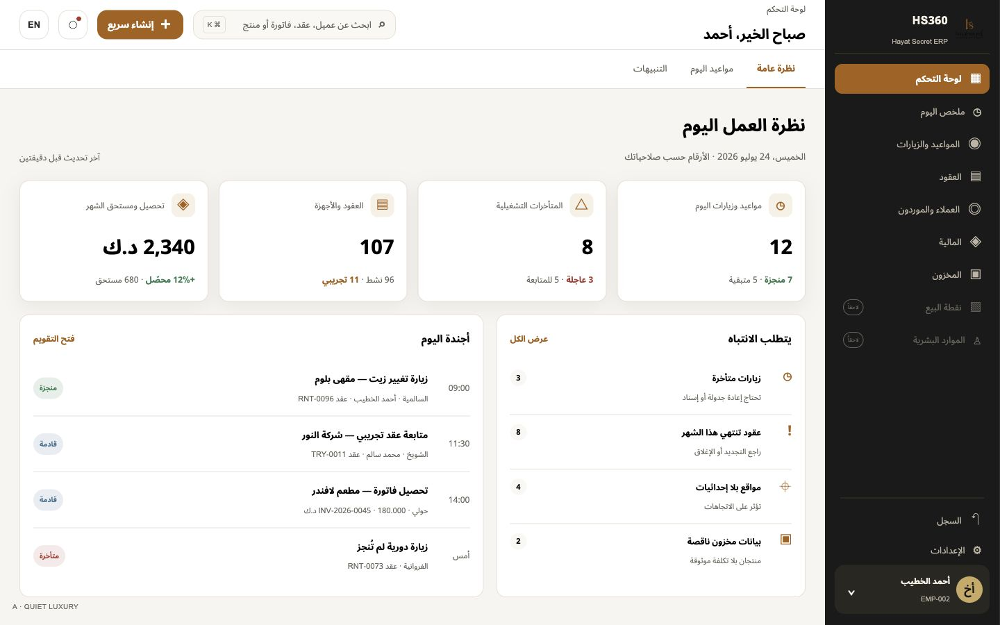

- Dark charcoal sidebar with restrained brand-gold detail.
- Warm near-white canvas and elevated cards.
- Balanced density and strong separation between navigation and work content.
- Best fit when the brand should remain visibly premium without making the ERP
  feel decorative.

## Option B — Operational Clarity

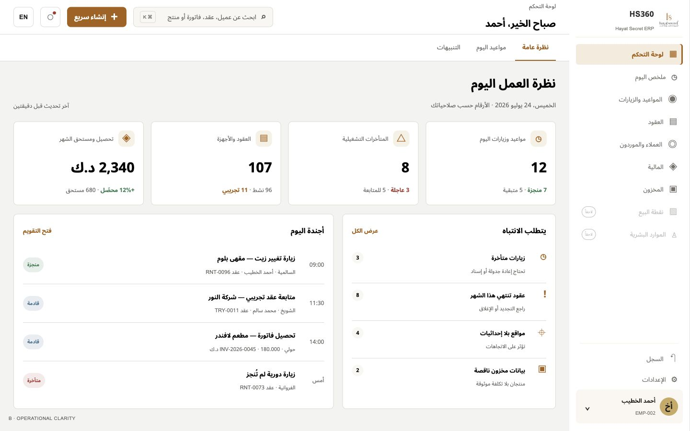

- Light sidebar and white surfaces with compact spacing and thin dividers.
- Active navigation uses a soft gold background plus a strong edge marker.
- Highest information density and closest to conventional professional ERP
  products.
- Best fit when speed, scanning, and long daily sessions take precedence over a
  distinctive luxury expression.

## Option C — Executive Warmth

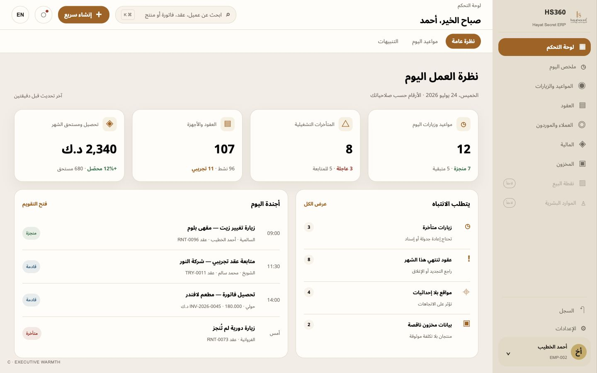

- Warm stone sidebar and cream canvas.
- Larger radii, more breathing space, and pill-style contextual tabs.
- Friendlier and more contemporary, especially for overview and customer-facing
  administrative screens.
- Best fit when the product should feel calm and approachable, accepting
  slightly lower information density.

## Comparison

| Criterion | A — Quiet Luxury | B — Operational Clarity | C — Executive Warmth |
|---|---|---|---|
| Brand presence | Strong | Restrained | Warm |
| Information density | Medium | High | Medium-low |
| Long-session scanning | Strong | Strongest | Good |
| Visual distinctiveness | Strongest | Moderate | Strong |
| Finance/inventory fit | Strong | Strongest | Good |
| Dashboard/customer fit | Strongest | Strong | Strong |

## Historical Planning Recommendation

Before owner selection, **Option A — Quiet Luxury** was the planning
recommendation because it
balances the accepted premium Hayat Secret identity with clear operational
hierarchy. If selected, M0 should still borrow Option B's compact table/filter
density for Finance and Inventory rather than forcing dashboard spacing onto
data-heavy screens.

## Complete Selected-C Reference Set

### Expanded Dashboard — Arabic RTL

### Collapsed/Narrow Shell — Arabic RTL

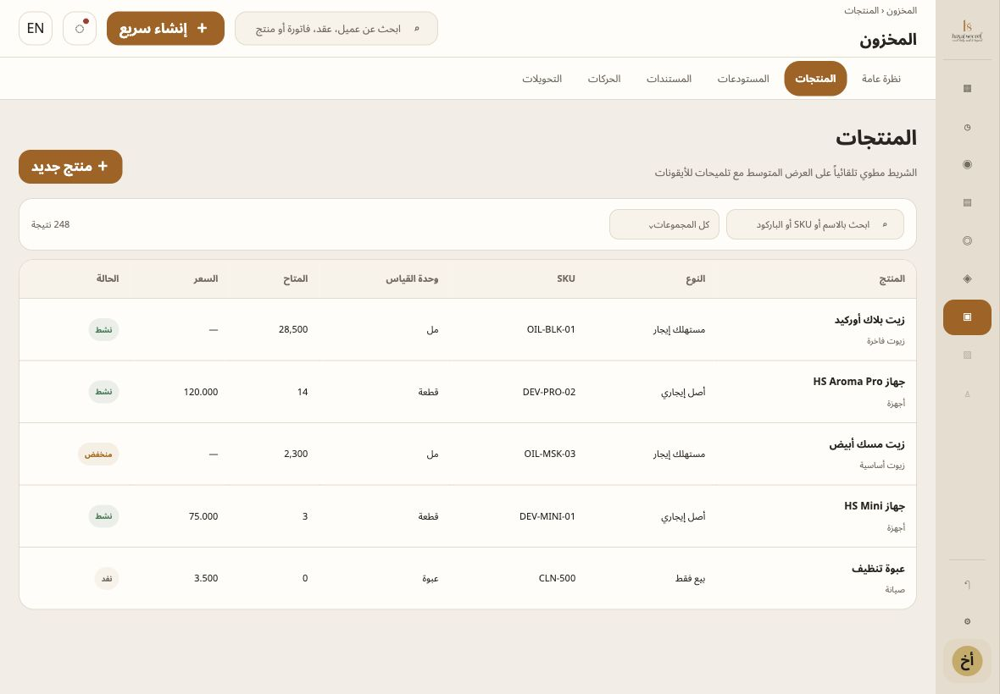

### Inventory — Arabic RTL, Compact Data Density

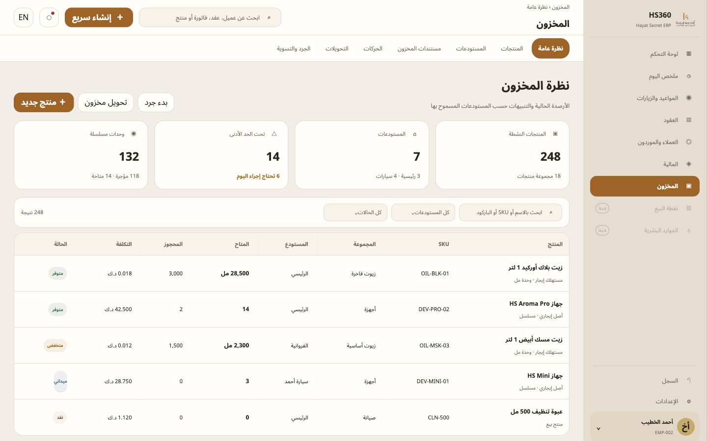

### Finance — Arabic RTL, Compact Data Density

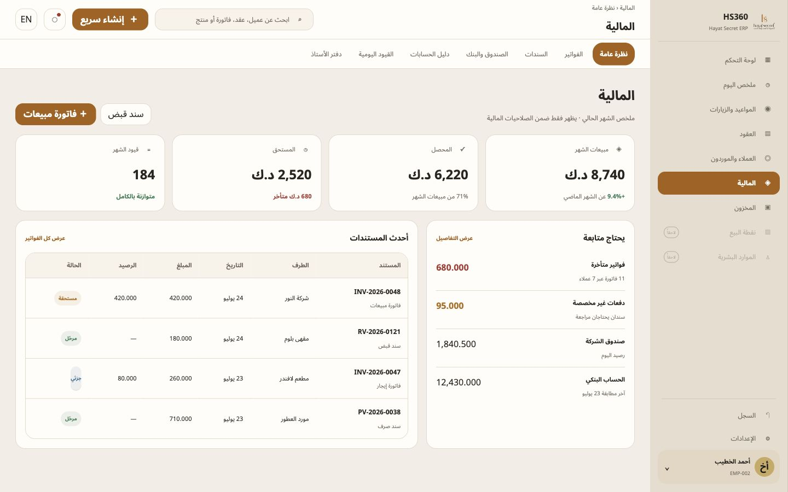

### Representative Contract Detail — Arabic RTL

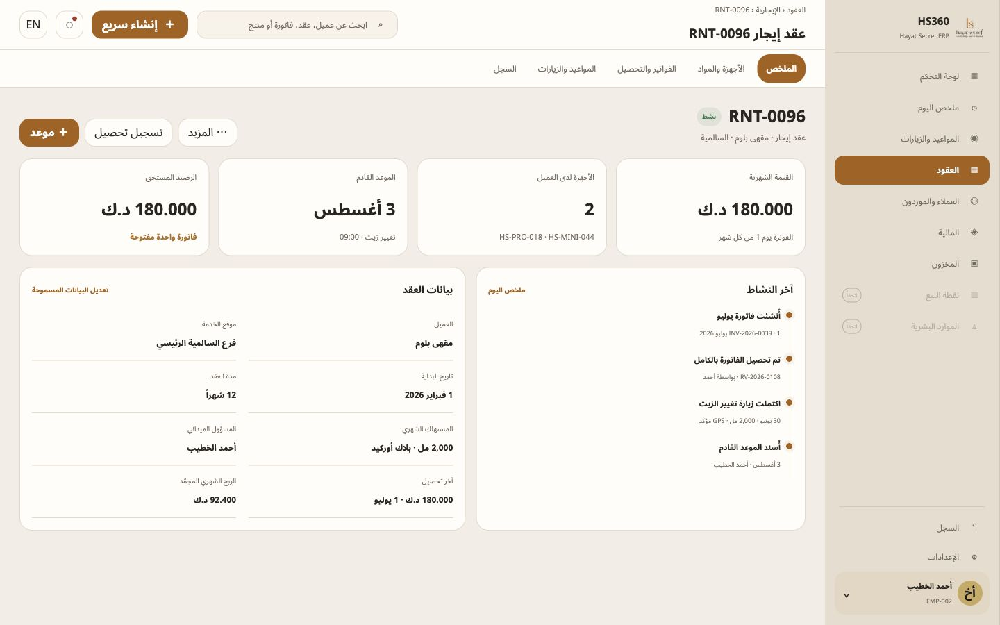

### Expanded Dashboard — English LTR

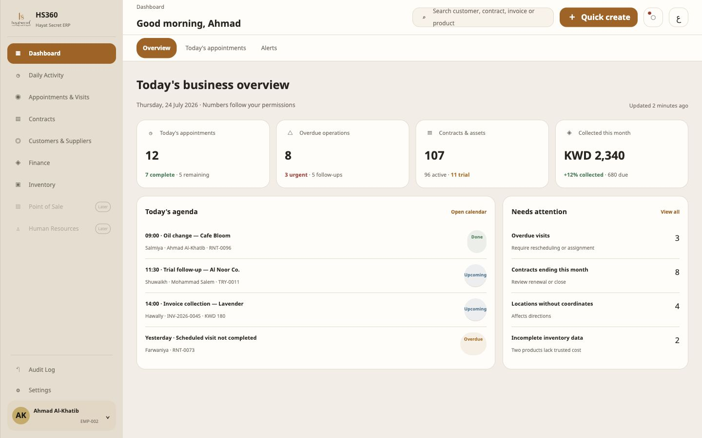

### Phase 8 Mobile Direction — Field/Hybrid

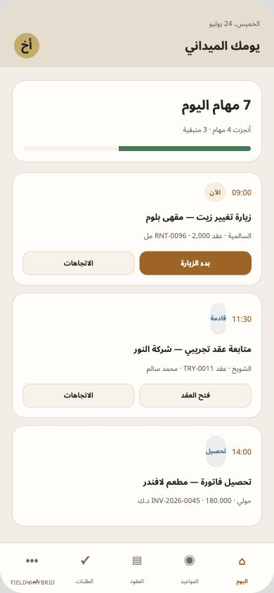

### Phase 8 Mobile Direction — Administrative

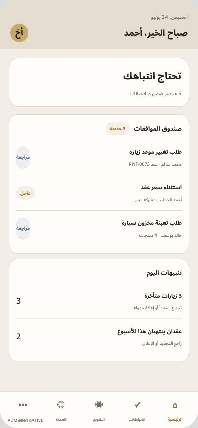

### Phase 8 Mobile Direction — Side-by-Side Contract

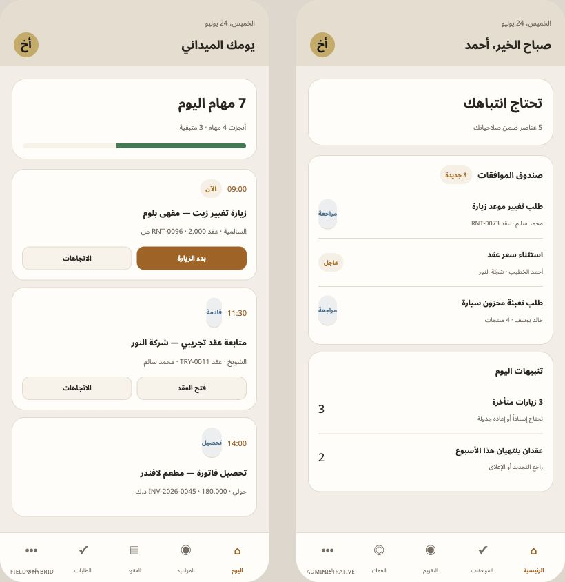

## Owner Acceptance

The owner accepted the complete Selected-C reference set on 2026-07-24. The
route/module/back-target and permission visibility contracts were then closed
in `M0_ROUTE_MODULE_MATRIX.md` and `M0_PERMISSION_VISIBILITY_MATRIX.md`.
`M0_ACCEPTANCE_RECORD.md` is the canonical evidence index.

## Original Selection Gate (Closed)

The original gate was to select A, B, or C. It is closed with Option C. The
selected direction was expanded into:

1. expanded desktop shell;
2. collapsed/narrow shell;
3. Dashboard;
4. Inventory;
5. Finance;
6. representative detail page;
7. Phase 8 field/admin mobile direction;
8. Arabic RTL and English LTR pair.
